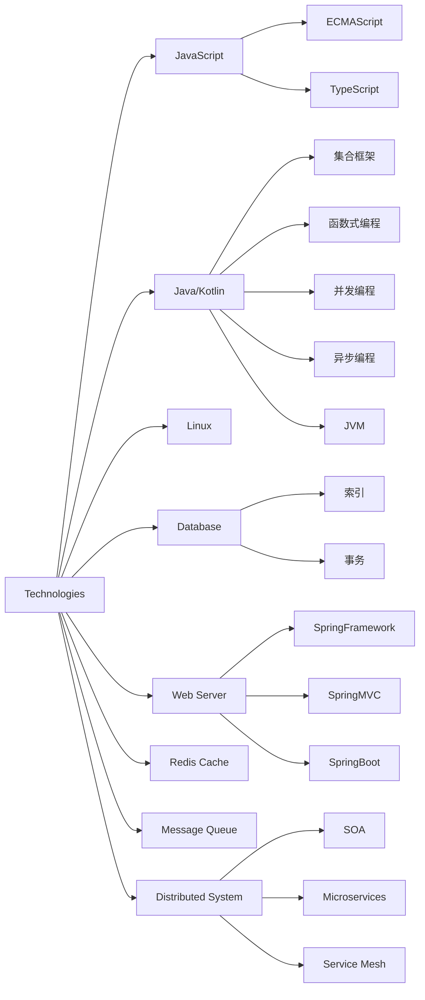

```mermaid
graph LR
    Root[Technologies]

    JS[JavaScript]
    Root --> JS
        ES[ECMAScript]
        JS --> ES
        TS[TypeScript]
        JS --> TS

    Java[Java/Kotlin]
    Root --> Java
        Collection[集合框架]
        Java --> Collection
        Stream[函数式编程]
        Java --> Stream
        Concurrent[并发编程]
        Java --> Concurrent
        Async[异步编程]
        Java --> Async
        JVM[JVM]
        Java --> JVM

    Linux[Linux]
    Root --> Linux

    DB[Database]
    Root --> DB
        DBIndex[索引]
        DB --> DBIndex
        Transaction[事务]
        DB --> Transaction

    WebServer[Web Server]
    Root --> WebServer
        Spring[SpringFramework]
        WebServer --> Spring
        SpringMVC[SpringMVC]
        WebServer --> SpringMVC
        SpringBoot[SpringBoot]
        WebServer --> SpringBoot

    Cache[Redis Cache]
    Root --> Cache

    MQ[Message Queue]
    Root --> MQ

    DS[Distributed System]
    Root --> DS
        SOA[SOA]
        DS --> SOA
        Microservices[Microservices]
        DS --> Microservices
        ServiceMesh[Service Mesh]
        DS --> ServiceMesh
```
